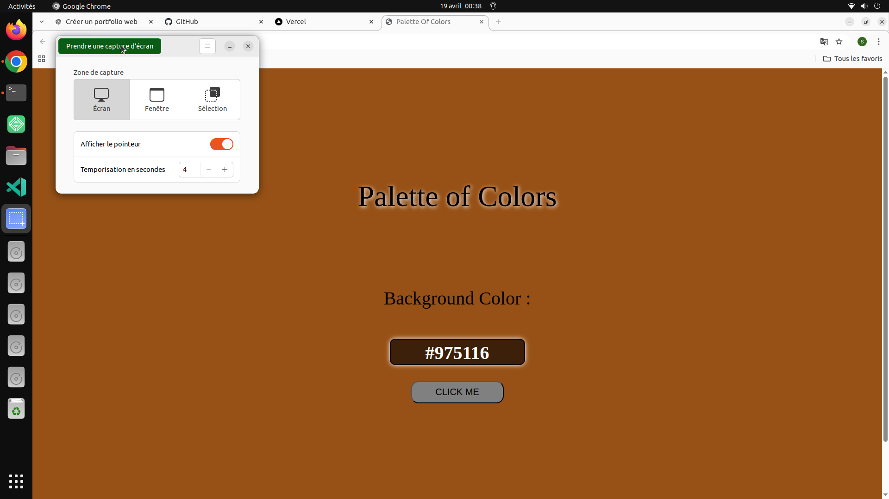

# 🎨 Palette of Colors

A modern color palette generator and visual explorer built with HTML, CSS, and JavaScript.

---

## 🔗 Live Demo
https://palette-of-colors.vercel.app

## 📂 GitHub Repository
https://github.com/saidhadjadj/palette-of-colors

---

## 🌍 Overview
This project allows users to explore, generate, and visualize color palettes. It focuses on UI clarity, color harmony, and interactive design.

---

## ✨ Features
- 🎨 Color palette generation
- 🌈 Multiple color combinations
- 📋 Copy color codes easily
- 📱 Fully responsive design
- ⚡ Lightweight and fast

---

## 📸 Preview

---

## 🛠️ Tech Stack
- HTML5
- CSS3
- JavaScript (ES6)

---

## 🎯 Purpose
This project explores color theory, UI design, and interactive front-end features.

---

## 👤 Author
Said Hadjadj
